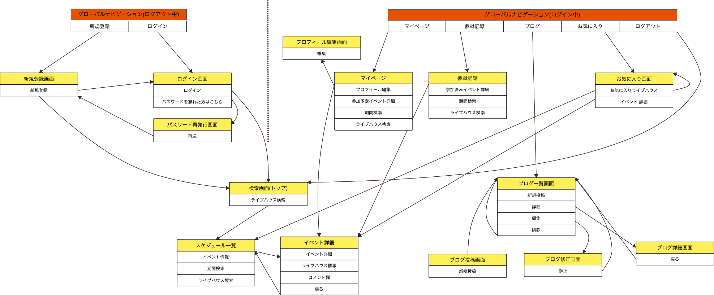

 
  
音楽を全身で感じることができるライブハウス。
「LiVEHOUSE」は、ふと思いついた時に行きたいライブハウスを探せるアプリです。


## 開発言語
- - -
- Ruby 3.0.1
- Rails 6.0.3

## 就業タームの技術
- - -
- devise
- Ajaxを使ったコメント機能
- お気に入り機能

## カリキュラム外の技術
- - -
- ransack(検索)
- nokogiri(Webスクレイピング)
- Google Map API(geocoder）

## 実行手順
- - -
```
$ git clone git@github.com:shunya-miyauchi/LiVEHOUSE.git
$ cd LiVEHOUSE
$ bundle install
$ rails db:create && rails db:migrate
$ rails s
```

## カタログ設計
- - -
https://docs.google.com/spreadsheets/d/1Br3E5tkoiFsEoQdsPsbxDvzELGNsf3hp4D6I-kL2ONc/edit?usp=sharing

## テーブル定義書
- - -
https://docs.google.com/spreadsheets/d/1Br3E5tkoiFsEoQdsPsbxDvzELGNsf3hp4D6I-kL2ONc/edit?usp=sharing

## ワイヤーフレーム
- - -
https://cacoo.com/diagrams/uR9Kx8YTM0qP5Ddw/53FE5

## ER図
- - -


## 画面遷移図
- - -


